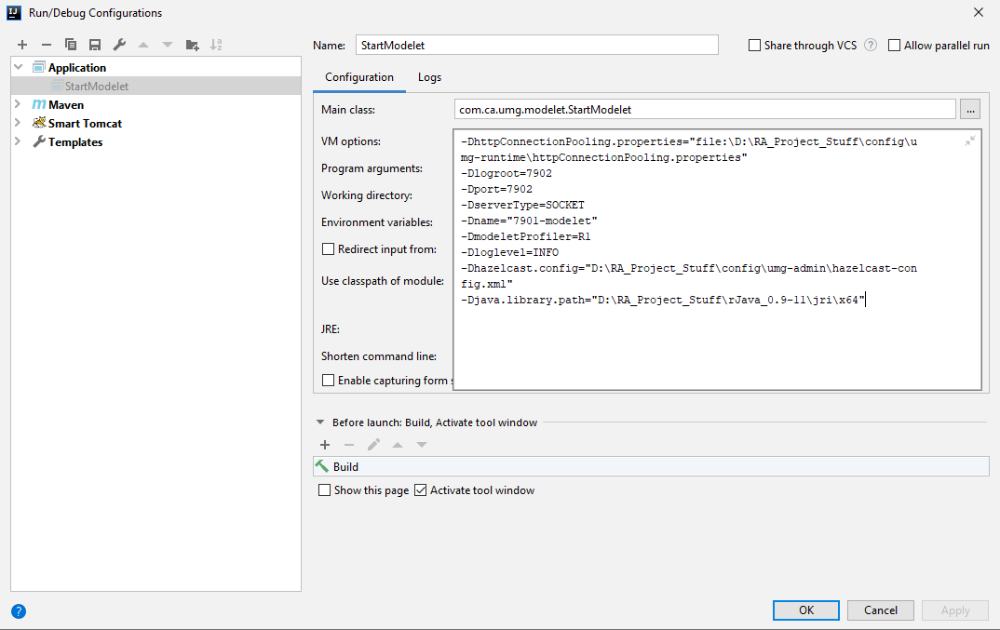

#modelet

## Setup modelet module

1. Install R on your machine. Currently we are using version 3.6.0
   [*Download from here*](https://cran.r-project.org/bin/windows/base/old/3.6.0/) 
2. Copy the **.dll** files from your R installation directory *"<<Installation-Path>>\R\R-3.6.0\bin\x64"* to java installation directory *"<<Installation-Path>>\Java\jdk1.8.0_102\bin"*
  
   Example: C:\Program Files\R\R-3.6.0\bin\x64 to C:\Program Files\Java\jdk1.8.0_102\bin
3. Download rjava to your machine. Currently we are using version 0.9-11
   [*Download from here*](https://cran.r-project.org/web/packages/rJava/index.html)
4. Create a new run configuration in your IDE with following details:
    * Main Class : com.ca.umg.modelet.StartModelet
    * Working Directory : *Path to your project*\umg
    * Vm Options : 
       ```text
          -DhttpConnectionPooling.properties="file:\D:\RA_Project_Stuff\config\umg-runtime\httpConnectionPooling.properties"
          -Dlogroot=7902
          -Dport=7902
          -DserverType=SOCKET
          -Dname="7901-modelet"
          -DmodeletProfiler=R1
          -Dloglevel=INFO
          -Dhazelcast.config="D:\RA_Project_Stuff\config\umg-admin\hazelcast-config.xml"
          -Djava.library.path="D:\RA_Project_Stuff\rJava_0.9-11\jri\x64"
       ```
      Note : Paths have to be changed accordingly (as per your setup)
      
      

5. Now run the configuration created in step 4 and it will be connected to umg-runtime. 
  
   Note: umg-runtime has to be started first.